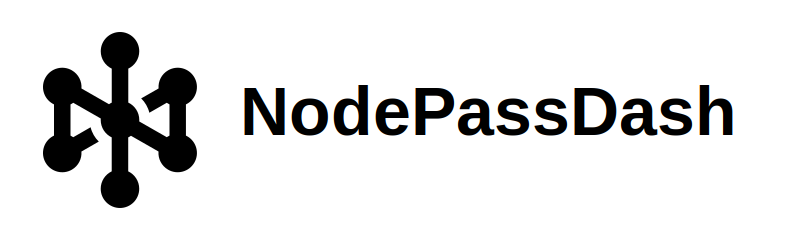

<div align="center">
  
</div>

**Language:** English | [简体中文](docs/zh-CN/README.md)


[](https://deepwiki.com/NodePassProject/nodepassdash)

NodePassDash is a modern web dashboard for managing **NodePass** endpoints, tunnels, and services. It ships as a single Go binary (Gin + GORM + SQLite/PostgreSQL) with an embedded React (Vite + TypeScript + HeroUI) frontend, and provides real-time telemetry via SSE/WebSocket.

## Highlights

- **Modern, clean dashboard**: responsive UI built with React + Vite + TypeScript + HeroUI.
- **Real-time monitoring**: SSE/WebSocket updates for tunnel status, traffic, and logs.
- **Multi-dimensional charts**: traffic trends (hour/day/week) with detailed drill-down views.
- **Powerful NodePass management**: endpoints, tunnels, and services in one place (including batch actions & sorting).
- **Scenario-based creation**: guided wizards/templates to create common setups faster and safer.
- **OAuth2 login support**: configure providers (e.g. GitHub / Cloudflare) and optionally disable password login.
- **i18n**: built-in multilingual UI support.
- **Personalization**: privacy mode, theme/language onboarding, and configurable experience.
- **Operational tooling**: file-log viewer, network debugging utilities, and endpoint system stats charts.
- **Mobile-friendly workflows**: QR code output for importing into the mobile app.
- **Safer at scale**: search/filter/sort, grouping, tagging, and batch operations for day-to-day maintenance.
- **Release awareness**: built-in version visibility and update notifications to help you stay current.
- **Portable architecture**: embedded frontend + single-service runtime, easy to run as a container or a systemd service.

## Screenshots

|                                                           |                                                             |                                                               |
|-----------------------------------------------------------|-------------------------------------------------------------|---------------------------------------------------------------|
|                    |              |                    |
|  |              |  |
|              |  |          |


## Quick Start

- **Docker (recommended):** `docs/en/DOCKER.md`
- **Binary + systemd:** `docs/en/BINARY.md`
- **Development:** `docs/en/DEVELOPMENT.md`

## Documentation

- **Migration Guide:** [MIGRATION.md](docs/en/MIGRATION.md)
- **Docker Guide:** [DOCKER.md](docs/en/DOCKER.md)
- **Binary Guide:** [BINARY.md](docs/en/BINARY.md)
- **Development Guide:** [DEVELOPMENT.md](docs/en/DEVELOPMENT.md)
- **Offline SQLite Compaction:** [SQLITE-MAINTENANCE.md](docs/en/SQLITE-MAINTENANCE.md)

## CLI Flags

```bash
./nodepassdash --help
./nodepassdash --version
./nodepassdash --port 8080
./nodepassdash --log-level INFO
./nodepassdash --cert /path/to/cert.pem --key /path/to/key.pem
./nodepassdash --disable-login
./nodepassdash --sse-debug-log
./nodepassdash --disable-sse-log         # Disable SSE log recording to files
./nodepassdash --resetpwd
```

## License

BSD-3-Clause. See `LICENSE`.

## Disclaimer

This project is provided “as is”, without any express or implied warranties. You are responsible for complying with local laws and regulations and using it only for lawful purposes. The authors are not liable for any direct, indirect, incidental, or consequential damages. The authors reserve the right to modify features and this statement at any time.

## Support

- Issues: https://github.com/NodePassProject/NodePassDash/issues

## Sponsors

<table>
  <tr>
    <td width="240" align="center">
      <a href="https://vps.town"></a>
    </td>
    <td width="240" align="center">
      <a href="https://whmcs.as211392.com"></a>
    </td>
  </tr>
  <tr>
    <td width="240" align="center">
      <a href="https://sharon.io"></a>
    </td>
    <td width="240" align="center">
      <a href="https://t.me/xiao_bai_xue_zhang"></a>
    </td>
  </tr>
</table>

---

© 2026 NodePassProject. All rights reserved.
